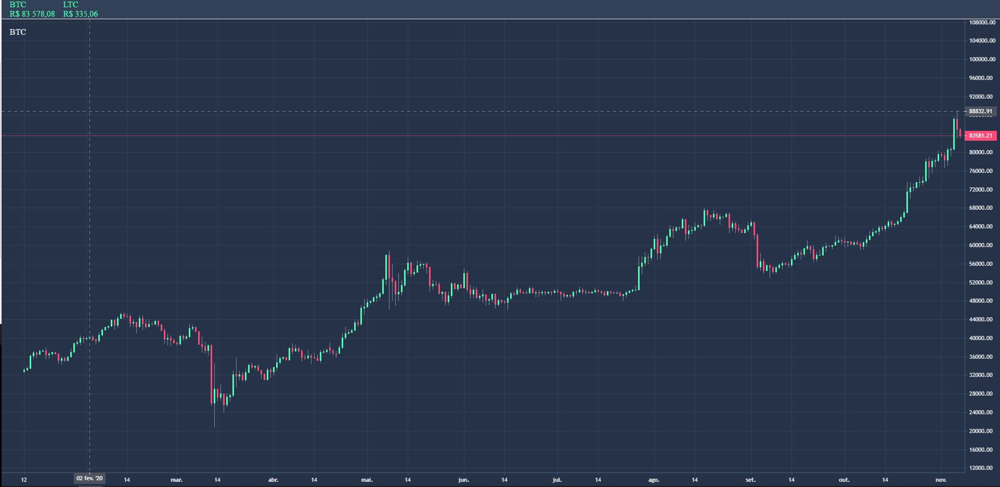

<h1 align="center">
    Cotação de criptomoedas
</h1>

<h1 align="center">
    
</h1>

## 🚀 Tecnologias

Esse projeto foi desenvolvido com a seguinte tecnologia:

- [React Native](https://facebook.github.io/react-native/)

## 💻 Projeto

Esse projeto foi desenvolvido durante a AvançaDev da **[fullcycle](https://fullcycle.com.br)**, que consiste em acompanhar a contação de criptomoedas,
além de implementar um integração contínua para vefiricar commit realizados.

Este projeto foi desenvolvido com ❤️ por **[@John Everton](https://www.linkedin.com/in/john-everton01/)**, com o instrutor **[@argentinaluiz](https://github.com/argentinaluiz)**.  
Se isso te ajudou, dê uma ⭐, isso vai me ajudar também! 😉

